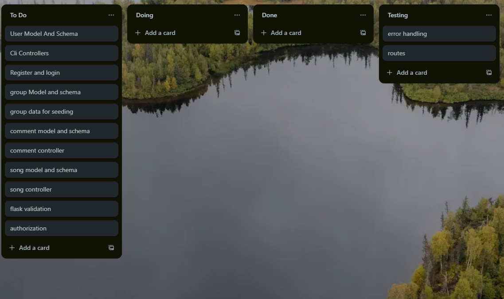
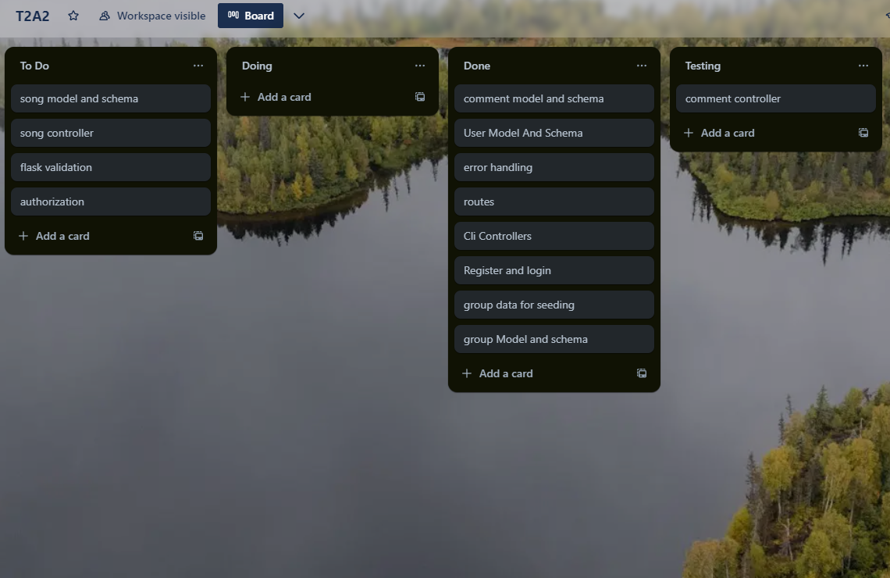
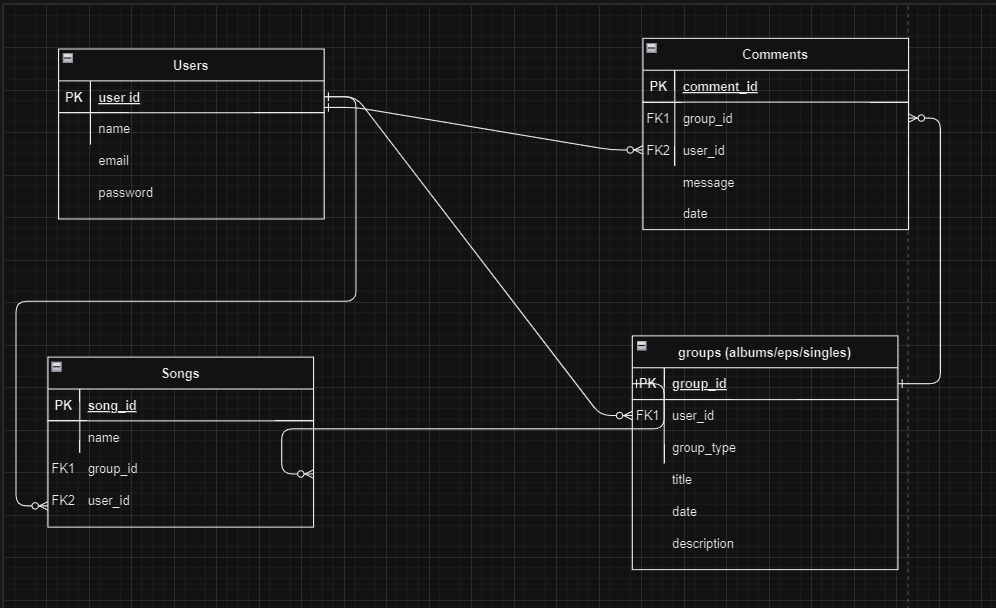

# T2A2 - Music Sharing API - Brodey Bright

[Github Repository](https://github.com/bbrodo/BrodeyBright_T2A2)

[Trello Board](https://trello.com/b/PtVRwZ2T/t2a2)

## Installation of the API app

The steps below assume you are running on a MacOS or Linux based operating system.

1. Clone the API to your local machine from the GitHub repo above
2. Open the `'src'` folder in your terminal of choice
3. Run `python3 -m venv venv`
4. Run `source venv/bin/activate`
5. Run `pip3 install -r requirements.txt` to install the required modules
6. Create a *database table* and *database user* to associate to this API in PostgreSQL
7. Create a `.env` file according to the `.envsample` and add your own *SECRET KEY* and *database URI*
8. Run `flask db create` to initialise the database and create the tables
9. Run `flask db seed` to get the default seed data for the database
10. Run `flask run` to start the flask server on `http://localhost:8080`
11. (Optional) Import the provided `docs/Insomnia_Routes.json` file into Insomnia to get a preconfigured list of all the available endpoints

## R1: Explain the problem that this app will solve, and explain how this app solves or addresses the problem.

Problem being solved:

1. Fragmentation of music discovery and sharing: In the digital age, music discovery and sharing have become increasingly fragmented across various platforms and services. Listeners often struggle to find new music that aligns with their tastes, while independent artists face challenges in reaching potential fans.

2. Limited engagement between artists and fans: Traditional music distribution models often create a barrier between artists and their audience, limiting direct interaction and engagement.

3. Inefficient music organization and curation: Users often struggle to organize their music libraries effectively, especially when dealing with various formats like singles, EPs, and albums.

How the app addresses these problems:

1. Centralized platform for music sharing and discovery: The API creates a unified platform where users can share, discover, and interact with music content. By incorporating features like user profiles, song uploads, and song groups (albums/EPs/singles), the app provides a comprehensive ecosystem for music enthusiasts.
2. Enhanced user engagement through comments: The inclusion of a comments table allows users to engage in discussions about specific songs or albums. This feature fosters a sense of community and enables direct communication between artists and fans, addressing the desire for increased interaction.
3. Improved music organization: By implementing a structure that includes songs and song groups, the API helps users and artists organize music more efficiently. This addresses the challenge of managing digital music collections mentioned.
4. Personalized music discovery: While not explicitly mentioned, the API's structure allows for the potential implementation of recommendation algorithms based on user interactions, comments, and listening habits. This could help combat the "choice overload" problem.
5. Support for independent artists: The platform can provide a level playing field for both established and independent artists to share their music.
6. Data-driven insights: The structured nature of your API (with tables for users, comments, songs, and song groups) allows for the collection and analysis of valuable data. This can provide insights into user preferences and behaviour, helping both artists and platform administrators make informed decisions.


## R2: Describe the way tasks are allocated and tracked in your project.

During the development of this project, I used Trello to track and manage the tasks I needed to complete.

At the beginning of the project I created a list of tasks I would be required to complete and placed them in the To Do list.

At the start of the day, I would review the Trello board, and move any tasks into the `Doing` section and focus on working those before looking back at the `To Do`  section.

I didn't use any deadlines on my tasks as I prefer to work at my own pace.

After I finished a task I would move it to the `Testing` section and check for any errors.

Whenever I finished testing the new code I would move the task to the `Done` section and move on to the next task.



## R3: List and explain the third-party services, packages and dependencies used in this app.

### PostgreSQL
PostgreSQL is a powerful open-source relational database management system. It provides robust data storage and management capabilities, including advanced features like views, foreign key constraints, and sophisticated locking mechanisms. In this project, PostgreSQL serves as the primary database for storing and managing all system information.

### Flask
For web application development, this project employs Flask, a lightweight and flexible Python web framework. Flask's simplicity and ease of use make it an excellent choice for building web applications, offering a balance of power and simplicity.

### SQLAlchemy
The project utilizes SQLAlchemy, a comprehensive Python ORM (Object-Relational Mapping) tool. SQLAlchemy allows developers to interact with databases using Python code, abstracting away the complexities of direct database operations. This high-level abstraction promotes efficient and performant database access while simplifying the development process.

### Psycopg2
To facilitate communication between Python and PostgreSQL, the project incorporates Psycopg2. This PostgreSQL adapter for Python enables the execution of SQL commands through Python code, establishing a direct connection to the PostgreSQL database.

### Bcrypt
For secure password management, the application implements Bcrypt, a robust password-hashing function. During user registration, Bcrypt creates and stores password hashes rather than plaintext passwords. It also handles password verification during the login process by comparing stored hashes with user input.

### Marshmallow
Marshmallow, an ORM framework library, is employed to convert SQL database data types into Python-compatible formats. It plays a crucial role in object serialization and deserialization, particularly in transforming database models into JSON objects for use in RESTful APIs.

### JWT-Extended
To handle user authentication and authorization, the project uses JWT-Extended, a Flask extension for working with JSON Web Tokens (JWT). This library facilitates the creation of login tokens and enables user privilege verification throughout the application.

### dotenv
The application uses the dotenv library to manage environment variables. By loading variables from a `.env` file, dotenv helps secure sensitive information such as secret keys and database credentials, keeping them separate from the main application code.


## R4: Explain the benefits and drawbacks of this app’s underlying database system.

Benefits:

1. Structured Data Organization:
The relational model allows for a clear and logical organization of data. Users, songs, comments, and song groups can be stored in separate tables with well-defined relationships between them.

Benefit: This structure facilitates efficient data retrieval and management, enabling complex queries and data integrity.

2. Data Integrity and Consistency:
The RDBMS provides mechanisms like foreign key constraints, unique constraints, and data validation rules.

Benefit: These features help maintain data integrity and consistency across the database, reducing the risk of orphaned records or inconsistent data.

3. ACID Compliance:

Benefit: This ensures data reliability and consistency, especially important for features like user comments or song uploads where multiple tables may need to be updated simultaneously.

4. Scalability:
Relational databases can handle large volumes of data and concurrent users efficiently when properly optimized.

Benefit: As the music sharing platform grows, the database can scale to accommodate more users, songs, and interactions.

5. Complex Query Capabilities:
SQL provides powerful querying capabilities, allowing for complex joins, aggregations, and data analysis.

Benefit: This enables features like advanced search, recommendation systems, and analytics for both users and administrators.

6. Security Features:
RDBMSs often come with built-in security features like user authentication, access control, and data encryption.

Benefit: These features help protect sensitive user data and copyrighted music content.

7. Standardization and Portability:
SQL is a standardized language, and many RDBMSs adhere to SQL standards.

Benefit: This makes it easier to migrate between different database systems if needed, and allows for easier integration with other tools and services.

Drawbacks:

1. Schema Rigidity:
Relational databases require a predefined schema, which can be challenging to modify once the application is in production and contains data.

Drawback: This can limit flexibility when rapid changes to the data model are required, such as adding new attributes to songs or users.

2. Performance with Large-Scale Data:
While RDBMSs can handle large amounts of data, performance can degrade with extremely large datasets, especially for complex queries involving multiple joins.

Drawback: As the music library and user base grow, I might face challenges in maintaining query performance without significant optimization or hardware upgrades.

3. Impedance Mismatch:
There can be a disconnect between the way data is represented in the database (tables and rows) and how it's used in application code (objects).

Drawback: This may require additional code or ORM (Object-Relational Mapping) tools to bridge the gap, potentially adding complexity to the application.

4. Horizontal Scaling Challenges:
While vertical scaling (adding more resources to a single server) is straightforward, horizontal scaling (distributing data across multiple servers) can be complex with traditional RDBMSs.

Drawback: This could pose challenges if the application needs to scale beyond the capabilities of a single server.

5. Potential for Over-normalization:
In an attempt to minimize data redundancy, there's a risk of over-normalizing the database schema.

Drawback: This can lead to performance issues due to the need for multiple joins in queries, especially for frequently accessed data like user profiles or song metadata.

6. Limited Support for Unstructured Data:
Traditional RDBMSs are not optimized for handling unstructured data like audio files or complex metadata.

Drawback: I might need to use a hybrid approach, storing file paths in the database and the actual audio files in a separate file system, which can add complexity to the application architecture.

7. Potential Licensing Costs:
Depending on the specific RDBMS chosen (e.g., Oracle, Microsoft SQL Server), there might be significant licensing costs as the application scales.

Drawback: This could impact the overall cost of running and scaling the application, especially for a startup or small business.
## R5: Explain the features, purpose and functionalities of the object-relational mapping system (ORM) used in this app.


Features, Purpose, and Functionalities of ORM:

1. Abstraction of Database Operations:
Purpose: To simplify database interactions by allowing developers to work with Python objects instead of writing raw SQL.
Functionality: ORM translates Python code into appropriate SQL commands.

2. Database Agnostic:
Purpose: To provide flexibility in choosing and switching between different database systems.
Functionality: ORM allows the same Python code to work with various databases (e.g., PostgreSQL, MySQL, SQLite) with minimal changes.

3. Model Definition:
Purpose: To represent database tables as Python classes.
Functionality: Developers define models (classes) that correspond to database tables, with attributes representing columns.

4. Relationship Handling:
Purpose: To manage and represent relationships between different database tables.
Functionality: ORM provides ways to define and work with relationships (one-to-many, many-to-many, etc.) using Python syntax.

5. Query Building:
Purpose: To construct database queries using Python methods and expressions.
Functionality: ORM offers an intuitive API for building complex queries without writing raw SQL.

6. Data Validation:
Purpose: To ensure data integrity at the application level.
Functionality: ORMs often include features for data validation before insertion or update operations.

7. Migration Support:
Purpose: To manage database schema changes over time.
Functionality: Many ORMs provide tools to create, apply, and manage database migrations.

Code example:


```python
from sqlalchemy import create_engine, Column, Integer, String, ForeignKey
from sqlalchemy.ext.declarative import declarative_base
from sqlalchemy.orm import relationship, sessionmaker

Base = declarative_base()

class User(Base):
    __tablename__ = 'users'

    id = Column(Integer, primary_key=True)
    username = Column(String(50), unique=True, nullable=False)
    email = Column(String(120), unique=True, nullable=False)
    
    songs = relationship('Song', back_populates='user')
    comments = relationship('Comment', back_populates='user')

class Song(Base):
    __tablename__ = 'songs'

    id = Column(Integer, primary_key=True)
    title = Column(String(100), nullable=False)
    artist = Column(String(100), nullable=False)
    user_id = Column(Integer, ForeignKey('users.id'), nullable=False)
    
    user = relationship('User', back_populates='songs')
    comments = relationship('Comment', back_populates='song')
    song_groups = relationship('SongGroup', secondary='song_group_association')

class Comment(Base):
    __tablename__ = 'comments'

    id = Column(Integer, primary_key=True)
    content = Column(String(500), nullable=False)
    user_id = Column(Integer, ForeignKey('users.id'), nullable=False)
    song_id = Column(Integer, ForeignKey('songs.id'), nullable=False)
    
    user = relationship('User', back_populates='comments')
    song = relationship('Song', back_populates='comments')

class SongGroup(Base):
    __tablename__ = 'song_groups'

    id = Column(Integer, primary_key=True)
    name = Column(String(100), nullable=False)
    group_type = Column(String(20), nullable=False)  # e.g., 'album', 'EP', 'single'
    
    songs = relationship('Song', secondary='song_group_association')

class SongGroupAssociation(Base):
    __tablename__ = 'song_group_association'

    song_id = Column(Integer, ForeignKey('songs.id'), primary_key=True)
    song_group_id = Column(Integer, ForeignKey('song_groups.id'), primary_key=True)

# Create an engine and session
engine = create_engine('sqlite:///music_app.db')
Session = sessionmaker(bind=engine)
session = Session()

# Create the tables
Base.metadata.create_all(engine)

# Example usage
new_user = User(username='music_lover', email='lover@example.com')
new_song = Song(title='Awesome Track', artist='Cool Artist', user=new_user)
new_comment = Comment(content='Great song!', user=new_user, song=new_song)
new_album = SongGroup(name='Awesome Album', group_type='album')
new_album.songs.append(new_song)

session.add_all([new_user, new_song, new_comment, new_album])
session.commit()

# Query example
user_songs = session.query(Song).filter(Song.user_id == new_user.id).all()
for song in user_songs:
    print(f"{song.title} by {song.artist}")

session.close()

```

This example demonstrates several key ORM features:

1. Model Definition: Classes like `User`, `Song`, `Comment`, and `SongGroup` represent database tables.

2. Relationship Handling: 
   - One-to-Many: `User` to `Song` and `Comment`
   - Many-to-Many: `Song` to `SongGroup` (using an association table)

3. Abstraction of Database Operations: The code uses Python classes and methods instead of SQL.

4. Query Building: The example shows how to construct a query using the ORM's API.

5. Data Integrity: Foreign key constraints are defined in the model (e.g., `user_id` in `Song` class).

6. Database Agnostic: The code uses SQLite, but could easily be switched to another database by changing the `create_engine` parameter.

## R6: Design an entity relationship diagram (ERD) for this app’s database, and explain how the relations between the diagrammed models will aid the database design.





1. User-Song Relationship (One-to-Many):

Benefits:
- Allows tracking of which user uploaded each song
- Enables easy retrieval of all songs uploaded by a specific user
- Maintains data integrity by ensuring each song is associated with a valid user

This relationship aids in:
- User profile features (displaying a user's uploaded songs)
- Content management (managing user-specific content)
- Copyright and ownership tracking

2. User-Comment and Song-Comment Relationships (One-to-Many):

Benefits:
- Enables a commenting system where users can comment on songs
- Allows easy retrieval of all comments for a song or by a user
- Maintains the context of each comment (which user commented on which song)

This relationship aids in:
- Building a community feature around shared music
- Implementing moderation tools for user-generated content
- Creating engagement metrics (e.g., most commented songs)

3. Song-Group Relationship (Many-to-One):

Benefits:
- Allows songs to be part of one group
- Enables flexible organization of music content
- Supports various music release formats (singles, EPs, albums)

This relationship aids in:
- Implementing album/EP management features
- Supporting diverse music cataloguing needs

How these relations aid the overall database design:

1. Data Integrity:
   - Foreign key constraints ensure that relationships are always valid (e.g., comments always belong to existing users and songs)
   - Prevents orphaned records and maintains data consistency

2. Efficient Querying:
   - Allows for efficient joins between related tables
   - Enables complex queries like "find all comments on songs in a specific album" without complex manual data linking

3. Scalability:
   - The structure supports growth in users, songs, and interactions without requiring major schema changes

4. Feature Support:
   - The design naturally supports key features like user profiles, music organization, and social interactions
   - Enables easy implementation of features like "most active users" or "most commented songs"

5. Data Normalization:
   - Reduces data redundancy by separating entities into distinct tables
   - Improves data consistency and reduces storage requirements

6. Flexibility:
   - The design allows for easy addition of new features (e.g., adding a 'likes' feature would be straightforward)
   - Supports various music consumption models (individual tracks, albums)

7. Performance Optimization:
   - Relationships allow for strategic indexing to optimize common query patterns
   - Enables efficient data retrieval for complex operations like generating user activity feeds

8. Maintainability:
   - Clear separation of concerns makes it easier to update or modify specific aspects of the app
   - Relationships reflect real-world connections, making the database structure intuitive for developers

## R7: Explain the implemented models and their relationships, including how the relationships aid the database implementation.


1. User Model:

Relationships:
- One-to-Many with Song: A user can upload multiple songs.
- One-to-Many with Comment: A user can make multiple comments.

How it aids implementation:
- Enables user authentication and profile management.
- Allows tracking of user-generated content (songs and comments).
- Supports features like user activity feeds and content moderation.

2. Song Model:

Relationships:
- Many-to-One with User: Each song is uploaded by one user.
- One-to-Many with Comment: A song can have multiple comments.
- Many-to-One with Group: Many songs can belong to one group.

How it aids implementation:
- Centralizes song metadata management.
- Enables features like song listings, search functionality, and song detail pages.
- Supports complex queries, such as "most commented songs" or "songs by a specific artist".

3. Comment Model:

Relationships:
- Many-to-One with User: Each comment is made by one user.
- Many-to-One with Song: Each comment is associated with one song.

How it aids implementation:
- Enables a robust commenting system.
- Supports social features and user engagement.
- Allows for easy retrieval of comments for a specific song or by a specific user.

4. Group Model:

Relationships:
- One-to-Many with Song: A song group can contain multiple songs.

How it aids implementation:
- Enables flexible organization of music content (albums, EPs).
- Supports various music consumption models.
- Allows for complex queries like "all songs in an album".

How these relationships aid the database implementation:

1. Data Integrity:
   - Foreign key constraints (e.g., `user_id` in Song model) ensure referential integrity.
   - Prevents orphaned records (e.g., comments without associated users or songs).

2. Efficient Querying:
   - Relationships allow for efficient JOINs between tables.
   - Enables complex queries without manual data linking.

3. Scalability:
   - The structure supports growth in users, songs, and interactions.

4. Feature Implementation:
   - Directly supports key features like user profiles, music organization, and social interactions.
   - Enables easy implementation of features like "most active users" or "trending songs".

5. Data Normalization:
   - Reduces data redundancy by separating entities into distinct tables.
   - Improves data consistency and reduces storage requirements.

6. Flexibility:
   - The design allows for easy addition of new features (e.g., adding a 'likes' feature).
   - Supports various music consumption models (individual tracks, albums).

7. Performance Optimization:
   - Relationships allow for strategic indexing to optimize common query patterns.
   - Enables efficient data retrieval for complex operations.

8. Maintainability:
   - Clear separation of concerns makes it easier to update or modify specific aspects of the app.
   - Relationships reflect real-world connections, making the database structure intuitive.

## R8: Explain how to use this application’s API endpoints.

### Authentication Routes

#### `POST - /auth/register` (User Registration)

- This route allows users to register an account with the application which can then be used in the `/auth/login` route.

**Parameters/Response Body**:

- `username`: String - the username of the user
- `password`: String - the password of the user

Example request body:

```JSON
{
    "username": "Test User 1",
    "email": "user1@email.com",
    "password": "abcd123@"
}
```

**Response**:

- Returns the created user account details including user_id, username, email, is_admin status.

Example response:

```JSON
{
	"id": 1,
	"name": "Test User 1",
	"email": "user1@email.com",
	"is_admin": false,
	"groups": [],
	"songs": [],
	"comments": []
}
```

#### `POST - /auth/login` (User Login)

- This route allows users to login with an account that has been previously registered.

**Parameters/Response Body**:

- `email`: String - the email of the user
- `password`: String - the password of the user

Example request body:

```JSON
{
    "email": "user1@email.com",
    "password": "abcd123@"
}
```

**Response**:

- Returns the JWT token of the logged in user, along with email and is_admin status.

Example response:

```JSON
{
    "email": "user1@email.com",
    "is_admin": false,
    "token": "(TOKEN HERE)"
}
```

#### DELETE - /auth/users/{user_id} (Deletes A User)

- This route allows users to delete an individual user from the database.
- It requires the user to be logged in with an **admin** account or the owner of the user being deleted.

**Parameters/Response Body**:

- None needed.
- User_id is passed through the route

**Response**:

- Returns a message that the corresponding user has successfully been deleted.

Example response:

``` JSON
{
	"message": "User with id 3 deleted"
}
```

### Group Routes
#### GET - /groups/{group_id} (Get One Group)

- This route allows users to retrieve an individual group record.

**Parameters/Response Body**:

- None needed
- Group id is passed through the route.

**Response**:

- Returns the group record with the corresponding id.

Example response:

```JSON
{
	"date": "2024-07-12",
	"description": "single 1 desc",
	"id": 2,
	"title": "Single 1",
	"type": "Single",
	"user": {
		"email": "admin@email.com",
		"id": 1,
		"name": null
	}
}
```
#### GET - /groups (Get All Groups)

- This route allows users to retrieve all group records within the database.

**Parameters/Response Body**:

- None needed

**Response**:

- Returns a list of all groups.

Example response:

```JSON
[
	{
		"id": 1,
		"title": "Album 1",
		"description": "album 1 desc",
		"date": "2024-07-21",
		"type": "Album",
		"user": {
			"id": 1,
			"name": null,
			"email": "admin@email.com"
		},
		"songs": [
			{
				"id": 1,
				"name": "Song 1",
				"user": {
					"name": "User 1",
					"email": "user1@email.com"
				}
			},
			{
				"id": 2,
				"name": "Song 2",
				"user": {
					"name": null,
					"email": "admin@email.com"
				}
			}
		],
		"comments": [
			{
				"id": 1,
				"message": "Comment 1",
				"date": "2024-07-21",
				"user": {
					"name": "User 1",
					"email": "user1@email.com"
				}
			},
			{
				"id": 2,
				"message": "Comment 2",
				"date": "2024-07-21",
				"user": {
					"name": null,
					"email": "admin@email.com"
				}
			}
		]
	},
	{
		"id": 2,
		"title": "Single 1",
		"description": "single 1 desc",
		"date": "2024-07-21",
		"type": "Single",
		"user": {
			"id": 1,
			"name": null,
			"email": "admin@email.com"
		},
		"songs": [],
		"comments": []
	}
]
```

#### POST - /groups (Creates A Group)

- This route allows users to create a new group and add it to the database.

**Parameters/Response Body**:

- `title`: String - the title of the group.
- `description`: String - the description of the group.
- `type`: String - the type of group (must be one of these: ("Album", "Single", "EP", "LP"))

**Example Request Body:**

``` JSON
{
	"title" : "album 1",
	"description": "desc",
	"type" : "Album"
}
```

**Response**:

- Returns the newly created group with the corresponding fields.

Example response:

``` JSON
{
	"date": "2024-07-12",
	"description": "desc",
	"id": 5,
	"title": "album 1",
	"type": "Album",
	"user": {
		"email": "user1@email.com",
		"id": 2,
		"name": "User 1"
	}
}
```

#### DELETE - /groups/{group_id} (Deletes A Group)

- This route allows users to delete an individual group from the database.
- It requires the user to be logged in with an **admin** account or the owner of the group being deleted.

**Parameters/Response Body**:

- None needed.
- Group_id is passed through the route

**Response**:

- Returns a message that the corresponding group has successfully been deleted.

Example response:

``` JSON
{
	"message": "group 'album 1' deleted successfully"
}
```

#### PATCH - /groups/{group_id} (Edits A Group)

- This route allows users to edit an individual groups fields.
- It requires the user to be logged in with an **admin** account or the owner of the group being deleted.

**Parameters/Response Body**:

- `title`: String - the new title of the group.
- `description`: String - the new description of the group.

**Example Request Body:**
``` JSON
{
	"title": "new album 1"
}
```

**Response**:

- Returns the corresponding groups fields.

Example response:

``` JSON
{
	"date": "2024-07-12",
	"description": "desc",
	"id": 4,
	"title": "new album 1",
	"type": "Album",
	"user": {
		"email": "admin@email.com",
		"id": 1,
		"name": null
	}
}
```

### Comment Routes

#### POST - /groups/{group_id}/comments (Creates A Comment)

- This route allows users to create a new comment on an individual group and add it to the database.

**Parameters/Response Body**:

- `message`: String - the body of the comment

**Example Request Body:**

``` JSON
{
	"message" : "example message"
}
```

**Response**:

- Returns the group with the new comment.

Example response:

``` JSON
{
	"id": 5,
	"message": "exaple message",
	"date": "2024-07-12",
	"user": {
		"name": "User 1",
		"email": "user1@email.com"
	},
	"group": {
		"id": 3,
		"title": "Album 2",
		"description": "album 2 desc",
		"date": "2024-07-12",
		"type": "Album",
		"user": {
			"id": 2,
			"name": "User 1",
			"email": "user1@email.com"
		}
	}
}
```

#### PATCH - /groups/{group_id}/comments/{comment_id} (Edits A Comment)

- This route allows users to edit a comment on an individual group.

**Parameters/Response Body**:

- `message`: String - the body of the comment

**Example Request Body:**

``` JSON
{
	"message" : "example message"
}
```

**Response**:

- Returns the group with the new comment.

Example response:

``` JSON
{
	"id": 5,
	"message": "exaple message",
	"date": "2024-07-12",
	"user": {
		"name": "User 1",
		"email": "user1@email.com"
	},
	"group": {
		"id": 3,
		"title": "Album 2",
		"description": "album 2 desc",
		"date": "2024-07-12",
		"type": "Album",
		"user": {
			"id": 2,
			"name": "User 1",
			"email": "user1@email.com"
		}
	}
}
```

#### DELETE - /groups/{group_id}/comments/{comment_id} (Deletes A Comment)

- This route allows users to delete an individual comment from the database.
- It requires the user to be logged in with an **admin** account or the owner of the comment being deleted.

**Parameters/Response Body**:

- None needed.
- Group_id and Comment_id is passed through the route

**Response**:

- Returns a message that the corresponding comment has successfully been deleted.

Example response:

``` JSON
{
	"message": "Comment 'example comment' deleted successfully"
}
```

### Song Routes

#### POST - /groups/{group_id}/songs (Creates A Song)

- This route allows users to add a new song to an individual group and add it to the database.

**Parameters/Response Body**:

- `name`: String - the name of the song
- The group_id is passed through the route.

**Example Request Body:**

``` JSON
{
	"name" : "example name"
}
```

**Response**:

- Returns the group with the new song.

Example response:

``` JSON
{
	"id": 4,
	"name": "example name",
	"user": {
		"name": null,
		"email": "admin@email.com"
	},
	"group": {
		"id": 3,
		"title": "Album 2",
		"description": "album 2 desc",
		"date": "2024-07-21",
		"type": "Album",
		"user": {
			"id": 2,
			"name": "User 1",
			"email": "user1@email.com"
		},
		"comments": [
			{
				"id": 3,
				"message": "Comment 3",
				"date": "2024-07-21",
				"user": {
					"name": null,
					"email": "admin@email.com"
				}
			}
		]
	}
}
```

#### PATCH - /groups/{group_id}/songs/{song_id} (Edits A Song)

- This route allows users to edit a song on an individual group.

**Parameters/Response Body**:

- `name`: String - the new name of the song
- The group_id and song_id are passed through the route.

**Example Request Body:**

``` JSON
{
	"name" : "example name"
}
```

**Response**:

- Returns the group with the edited song.

Example response:

``` JSON
{
	"id": 4,
	"name": "example name",
	"user": {
		"name": null,
		"email": "admin@email.com"
	},
	"group": {
		"id": 3,
		"title": "Album 2",
		"description": "album 2 desc",
		"date": "2024-07-21",
		"type": "Album",
		"user": {
			"id": 2,
			"name": "User 1",
			"email": "user1@email.com"
		},
		"comments": [
			{
				"id": 3,
				"message": "Comment 3",
				"date": "2024-07-21",
				"user": {
					"name": null,
					"email": "admin@email.com"
				}
			}
		]
	}
}
```

#### DELETE - /groups/{group_id}/songs/{song_id} (Deletes A Song)

- This route allows users to delete an individual song from the database.
- It requires the user to be logged in with an **admin** account or the owner of the song being deleted.

**Parameters/Response Body**:

- None needed.
- Group_id and Song_id are passed through the route

**Response**:

- Returns a message that the corresponding comment has successfully been deleted.

Example response:

``` JSON
{
	"name": "song 'Song 3' deleted successfully"
}
```

